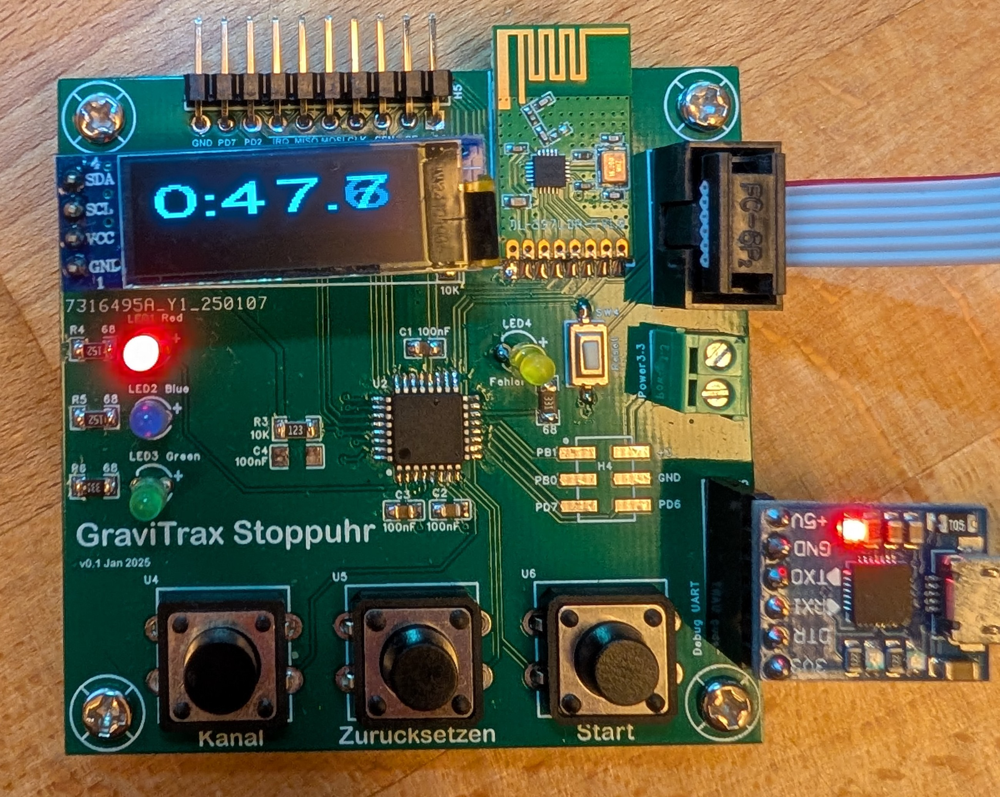

# Overview
Stopwatch react on 2.4GHz start/stop signals - works with famous game GraviTrax from Ravensburger. This is
my private work. I am not connected in any way to Ravensburger. This is not official supported.

# Content of this repo
- Board: current schematic and board in EasyEDA format
- Board v0.1: first version produced
- GTStoppuhr: Microchip solution
- xn297l_analyzer: Salea Logic 2 high level analyzer to debug XN297L_

# Current state
- the eeprom isn't used so far
- red channel is currently hardcoded; can't changed
- starts with remote or starter and stopwatch ends with trigger signal

## Possible improvements for next board revision:
- add Crystal (more precision :) )
- Change LED resistor to: Error/Yellow(330), Green(330), Red(1,5k), Blue(1,5k)
- add pin description to i2c header
- add i2c debug pin header
- add possibility to mount dispaly
- add 2nd i2c header for 90° rotated 128x64 OLED Display
- add jumper to allow USB VCC disconnect
- add jumper to disconnect USB 3.3V
- more space between error LED and MCU reset button
- move XN297L board more out of the board (provide more space for antenna)